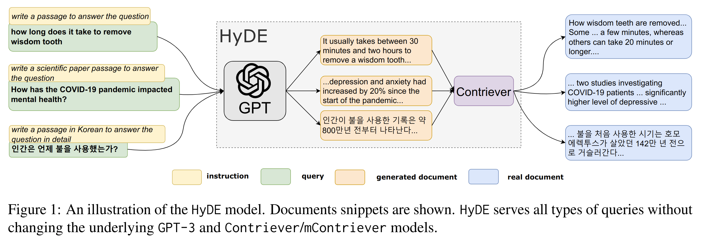

# HyDE: Precise Zero-Shot Dense Retrieval without Relevance Labels

This is code repository for the paper: [HyDE: Precise Zero-Shot Dense Retrieval without Relevance Labels](https://arxiv.org/abs/2212.10496).

**HyDE** zero-shot instructs GPT3 to generate a fictional document and re-encodes it with unsupervised retriever Contriever to search in its embedding space.
HyDE significantly outperforms Contriever across tasks and languages and it does not require any human labeled relevance judgement.



## Steps to run the code

1. Install `pyserini` by following the [guide](https://github.com/castorini/pyserini#-installation). We use pyserini to conduct dense retrieval and evaluation.


2. Download the prebuilt Contrever faiss index
```
wget  https://www.dropbox.com/s/dytqaqngaupp884/contriever_msmarco_index.tar.gz
tar -xvf contriever_msmarco_index.tar.gz
```

3. Setup GPT3 API key

```
export OPENAI = <your key>
```

4. Run `hyde-dl19.ipynb`, it will run the experiment on the TREC DL19 dataset. Run `hyde-demo.ipynb`, it will go through HyDE pipeline with an example query.


## Citation

```
@article{hyde,
  title = {Precise Zero-Shot Dense Retrieval without Relevance Labels},
  author = {Luyu Gao and Xueguang Ma and Jimmy Lin and Jamie Callan},
  journal={arXiv preprint arXiv:2212.10496},
  year = {2022}
}
```

# The Internal State of an LLM Knows When It’s Lying
The corresponded code resource is from https://github.com/balevinstein/probes

### About prober

1. The optional models currently including facebook/opt-350m/1.3b/opt-2.7b/6.7b, meta-llama/Llama-3.2-1B-Instruct (3B), meta-llama/Llama-3.1-8B-Instruct
2. Later the embeddings should be stored when generated the statements to avoid secondary calls.
3. For HyDE, you can use the **prediction_function.py** to get the token-level score.


### Files:

- **config.josn**: configuretion file. (You need supply huggingface token here)
- **threshold.json**: this is the threshold for binary classification.
- **generate_embedding.py**: This is used for get the hidden states of training dataset from true-and-false dataset, prepared to train the probe model.
- **model.py**: This is for the architecture of prober, currently it is SAPLMAClassifier (MLP from the cited paper)
- **train_unite.py:** This is to train the prober.
- **prediction.py**: This is for the token score prediction from the statements and to write the result into csv files.
- **prediction_function.py**: This is for the token score prediction from the statements with list of input, and output the list of result.
	- Input: 
		- statement list [stentence1, sentence2, …]
		- model_name: 350m, 1,3b, 2,7b or 6.7b (for opt model)
		- layer: The used layer for prober. (For now, it is -4)
	- Output:  [[word_list1], [word_list2], ...]
- Folder **probes**: This the trained probers.
- prediction_results_xx.csv: This is the output sample outputed by prediction.py.

